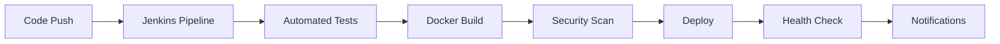

# 🏦 Home Credit Default Risk Prediction

[](https://www.python.org/downloads/)
[](https://www.docker.com/)
[](https://www.jenkins.io/)
[](https://opensource.org/licenses/MIT)


## 🎯 Business Problem

Many individuals struggle to access loans due to:
- Insufficient credit history
- Non-existent credit records
- Vulnerability to predatory lenders

**Home Credit Group's Mission**: Expand financial inclusion for the unbanked population by:
- Providing safe borrowing experiences
- Using alternative data for credit assessment
- Ensuring fair loan approval processes

## 📊 Data Infrastructure


### Core Datasets

| Dataset | Description | Size | Key Features |
|---------|-------------|------|--------------|
| `application_{train\|test}.csv` | Static application data | 500K+ rows | Demographic, financial info |
| `bureau.csv` | Credit Bureau records | 1.7M+ rows | Previous credits history |
| `bureau_balance.csv` | Monthly Credit Bureau data | 27M+ rows | Credit status changes |
| `POS_CASH_balance.csv` | Point of Sale/Cash loans data | 10M+ rows | Monthly loan snapshots |
| `credit_card_balance.csv` | Credit card history | 3.8M+ rows | Card usage patterns |
| `previous_application.csv` | Previous loan applications | 1.6M+ rows | Application history |
| `installments_payments.csv` | Repayment history | 13M+ rows | Payment patterns |

## 🚀 Deployment Options

### 1️⃣ Local Development
```bash
# Setup virtual environment
python -m venv venv
source venv/bin/activate  # Unix/macOS
.\venv\Scripts\activate   # Windows

# Install & Train
pip install -r requirements.txt
python model_training/src/model_training.py

# Launch Application
python credit_fraud_app/app.py
```

### 2️⃣ Docker Deployment (Recommended)
```bash
# Full Stack Deployment
docker-compose up --build

# Individual Components
# Model Training
cd model_training
docker build -t model-trainer .
docker run -v "$(pwd)/models:/app/models" model-trainer

# Web Application
cd credit_fraud_app
docker build -t credit-fraud-app .
docker run -p 5001:5000 credit-fraud-app
```

### 3️⃣ CI/CD Pipeline (Production)



## 🏗️ Architecture

```
HOME-CREDIT-DEFAULT-RISK/
├── 🔮 model_training/          # ML Pipeline
│   ├── src/
│   │   ├── model_training.py   # Training logic
│   │   └── model_testing.py    # Testing suite
│   ├── data/                   # Data storage
│   ├── models/                 # Model artifacts
│   └── Dockerfile             
├── 🌐 credit_fraud_app/        # Web Service
│   ├── app/
│   │   ├── static/            # Frontend assets
│   │   ├── templates/         # UI templates
│   │   └── models/           # Model deployment
│   └── Dockerfile
├── 🔄 jenkins/                 # CI/CD Config
└── 🐳 docker-compose.yml      # Orchestration
```

## 📊 Model Performance

| Metric    | Training | Testing |
|-----------|----------|---------|
| Accuracy  | 89.06%   | 88.96%  |
| Precision | 22.14%   | 21.44%  |
| Recall    | 14.06%   | 13.98%  |
| ROC AUC   | 54.86%   | 54.75%  |

### 📈 Performance Analysis

```python
import seaborn as sns
import matplotlib.pyplot as plt

# ROC Curve Visualization
plt.figure(figsize=(10, 6))
plt.plot(fpr, tpr, label=f'ROC (AUC = {roc_auc:.3f})')
plt.plot([0, 1], [0, 1], 'k--')
plt.xlabel('False Positive Rate')
plt.ylabel('True Positive Rate')
plt.title('ROC Curve')
plt.legend()
plt.show()
```

## 🛠️ Quick Commands

### Docker Operations
```bash
# Build Services
docker-compose build

# Launch Stack
docker-compose up -d

# Check Status
docker-compose ps

# View Logs
docker-compose logs -f

# Shutdown
docker-compose down
```

### Model Training
```bash
# Local Training
python model_training.py \
    --train-path data/application_train.csv \
    --test-path data/application_test.csv \
    --model-output models/credit_model.pkl

# Containerized Training
docker run -v $(pwd)/data:/app/data \
           -v $(pwd)/models:/app/models \
           model-trainer
```

## 🔄 CI/CD Pipeline Features

- **Automated Testing**: Unit tests, integration tests
- **Quality Checks**: Code style, complexity
- **Security**: Trivy scanning, dependency checks
- **Deployment**: Blue-green deployment strategy
- **Monitoring**: Health checks, performance metrics
- **Notifications**: Slack integration

## 📝 Development Notes

1. **Data Preprocessing**
   - Handle missing values
   - Feature engineering
   - Scaling/normalization

2. **Model Training**
   - XGBoost implementation
   - Hyperparameter optimization
   - Cross-validation

3. **Deployment**
   - Model serialization
   - API endpoint creation
   - Load balancing setup

## 🤝 Contributing

1. Fork the repository
2. Create feature branch
   ```bash
   git checkout -b feature/amazing-feature
   ```
3. Commit changes
   ```bash
   git commit -m 'Add amazing feature'
   ```
4. Push to branch
   ```bash
   git push origin feature/amazing-feature
   ```
5. Create Pull Request

---

<div align="center">
    <strong>🏦 Empowering Financial Inclusion Through Technology 🚀</strong>
</div>
