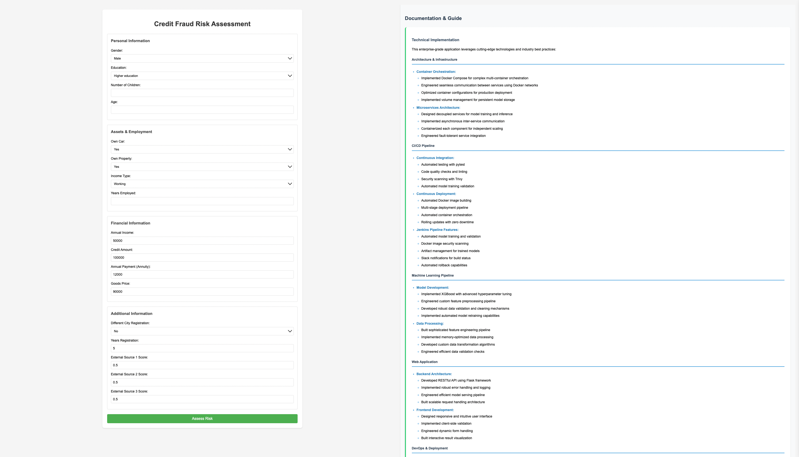

# Home Credit Default Risk

## Description
Many people struggle to get loans due to insufficient or non-existent credit histories. Unfortunately, this population is often taken advantage of by untrustworthy lenders. 



**Home Credit Group** strives to broaden financial inclusion for the unbanked population by providing a positive and safe borrowing experience. To ensure this underserved population has a positive loan experience, Home Credit utilizes a variety of alternative data—including telco and transactional information—to predict their clients' repayment abilities.

While Home Credit is currently using various statistical and machine learning methods to make these predictions, they are challenging Kagglers to help them unlock the full potential of their data. Doing so will ensure that clients capable of repayment are not rejected and that loans are given with a principal, maturity, and repayment calendar that will empower their clients to be successful.

## Dataset Description
The datasets used in this project include:


- **application_{train|test}.csv**: Static data for all applications. One row represents one loan in our data sample.
- **bureau.csv**: All client's previous credits provided by other financial institutions that were reported to Credit Bureau.
- **bureau_balance.csv**: Monthly balances of previous credits in Credit Bureau.
- **POS_CASH_balance.csv**: Monthly balance snapshots of previous POS (point of sales) and cash loans that the applicant had with Home Credit.
- **credit_card_balance.csv**: Monthly balance snapshots of previous credit cards that the applicant has with Home Credit.
- **previous_application.csv**: All previous applications for Home Credit loans of clients who have loans in our sample.
- **installments_payments.csv**: Repayment history for the previously disbursed credits in Home Credit related to the loans in our sample.
- **HomeCredit_columns_description.csv**: Descriptions for the columns in the various data files.

## Evaluation
Submissions are evaluated on the area under the ROC curve between the predicted probability and the observed target.


The project implements a robust CI/CD pipeline using Jenkins, Docker, and automated testing frameworks to ensure reliable model deployment and application updates. The pipeline orchestrates multiple stages: it begins with automated testing of the machine learning components, proceeds through model training in an isolated container, performs security scanning using Trivy, and concludes with containerized deployment of the Flask web application. The multi-stage Dockerfile optimizes the build process, while Docker Compose manages the microservices architecture, separating the model training and web serving components. The pipeline automatically pushes versioned Docker images to Docker Hub, enabling seamless rollbacks if needed. Environment variables and Jenkins credentials store manage sensitive information securely, while the modular structure allows independent scaling of components. Automated Slack notifications keep stakeholders informed of deployment status, and the containerized approach ensures consistency across development, staging, and production environments. Each commit triggers automated tests, model validation, and if successful, updates the production environment with zero-downtime deployments.

**Key Technical Features:**
- Automated ML model training and validation pipeline
- Containerized microservices architecture using Docker and Docker Compose
- Jenkins pipeline with multi-stage builds and security scanning
- Automated testing and quality assurance
- Continuous deployment with versioned Docker images
- Zero-downtime updates and automated rollback capabilities
- Secure credentials management and environment configuration
- Real-time deployment status notifications


## Setup and Installation

This project offers three deployment methods, ranging from local development to containerized deployment with CI/CD.

### Method 1: Local Development Setup
```bash
# Create virtual environment
python -m venv venv

# Activate virtual environment
# On Unix/macOS:
source venv/bin/activate
# On Windows:
.\venv\Scripts\activate

# Install dependencies
pip install -r requirements.txt

# Train model
cd model_training
python model_training.py

# Run Flask app
cd ../credit_fraud_app
python app.py
```

### Method 2: Docker Containerization (Recommended)
Prerequisites:
- [Docker](https://docs.docker.com/get-docker/)
- [Docker Compose](https://docs.docker.com/compose/install/)

```bash
# Build and run using Docker Compose
docker-compose up --build

# Or build and run containers separately:

# Build and run model training
cd model_training
docker build -t model-trainer .
docker run -v "$(pwd)/models:/app/models" model-trainer

# Build and run web application
cd ../credit_fraud_app
docker build -t credit-fraud-app .
docker run -p 5001:5000 -v "$(pwd)/app/models:/app/app/models" credit-fraud-app
```

### Method 3: CI/CD Pipeline with Jenkins
Prerequisites:
- Jenkins installed ([Installation Guide](https://www.jenkins.io/doc/book/installing/))
- Docker Hub account ([Sign up](https://hub.docker.com/signup))
- Docker installed on Jenkins server

```bash
# 1. Configure Jenkins
- Install required plugins:
  - Docker Pipeline
  - Docker
  - Pipeline Utility Steps
  - Slack Notification
  - Blue Ocean

# 2. Set up Docker Hub credentials in Jenkins
- Go to Jenkins Dashboard → Credentials → System
- Add Docker Hub credentials
- ID: docker-hub-credentials

# 3. Create Jenkins Pipeline
- New Item → Pipeline
- Configure Git repository
- Use Jenkinsfile from SCM

# 4. Run Pipeline
- Build Now
```

## Project Structure
```
HOME-CREDIT-DEFAULT-RISK/
├── model_training/                 # Model training service
│   ├── src/
│   │   ├── model_training.py      # Training script
│   │   └── model_testing.py       # Testing script
│   ├── data/                      # Training data
│   │   ├── application_test.csv
│   │   └── application_train.csv
│   ├── models/                    # Trained model storage
│   │   └── model.pkl
│   ├── Dockerfile                 # Training container config
│   └── requirements.txt           # Training dependencies
│
├── credit_fraud_app/              # Web application service
│   ├── app/
│   │   ├── static/               # CSS, JS files
│   │   ├── templates/            # HTML templates
│   │   ├── models/              # Model artifacts
│   │   └── __init__.py          # Flask app initialization
│   ├── config/
│   │   └── config.py            # App configuration
│   ├── Dockerfile               # Web app container config
│   └── requirements.txt         # Web app dependencies
│
├── jenkins/                      # CI/CD configuration
│   └── config.yaml              # Jenkins configuration
│
├── tests/                       # Test suites
│   ├── test_app.py             # Web app tests
│   └── test_model.py           # Model tests
│
├── docker-compose.yml           # Container orchestration
├── Jenkinsfile                 # CI/CD pipeline
├── .gitignore
└── README.md
```

## Infrastructure Features

### Container Orchestration
- Multi-container architecture with Docker Compose
- Separate containers for model training and web application
- Volume management for model persistence
- Network isolation between services

### CI/CD Pipeline
- Automated testing with pytest
- Code quality checks
- Docker image building and pushing
- Automated deployments
- Security scanning with Trivy
- Slack notifications for build status

### Development Features
- Hot-reloading for local development
- Debug mode configuration
- Comprehensive logging
- Environment-based configurations
- Health check endpoints
## Model Training

The model can be trained using either of these methods:

1. Using Python directly:
```bash
python model_training.py --train-path ../data/application_train.csv --model-output ../models/model.pkl
```

2. Using Docker:
```bash
docker run -v $(pwd)/models:/app/models -v $(pwd)/data:/app/data home-credit-model
```

## Docker Commands Reference

- Build the image:
```bash
docker build -t home-credit-model .
```

- Run the container:
```bash
docker run -v $(pwd)/models:/app/models -v $(pwd)/data:/app/data home-credit-model
```

- Check container status:
```bash
docker ps
```

- View container logs:
```bash
docker logs <container_id>
```

- Stop the container:
```bash
docker stop <container_id>
```

- Access container shell (for debugging):
```bash
docker exec -it <container_id> /bin/bash
```

## Notes
- The model outputs are saved to the `models` directory
- Docker volumes are used to persist the trained model and access data
- Make sure all required data files are present in the `data` directory before running the container


<h2 style="text-align: center;">Model Performance</h2>
    <table>
        <tr>
            <th>Metric</th>
            <th>Train</th>
            <th>Test</th>
        </tr>
        <tr>
            <td>Accuracy</td>
            <td>0.890630</td>
            <td>0.889550</td>
        </tr>
        <tr>
            <td>Precision</td>
            <td>0.221430</td>
            <td>0.214374</td>
        </tr>
        <tr>
            <td>Recall</td>
            <td>0.140572</td>
            <td>0.139826</td>
        </tr>
        <tr>
            <td>ROC AUC</td>
            <td>0.548564</td>
            <td>0.547492</td>
        </tr>
    </table>

Overall, the model shows reasonably consistent performance across the training and test sets, as indicated by similar values for accuracy, precision, recall, and ROC AUC. This consistency suggests that the model is not overfitting excessively to the training data and is generalizing reasonably well to unseen data. However, the low values of precision and recall indicate that the model may need further tuning or feature engineering to improve its ability to correctly classify positive cases (defaults) while minimizing false positives and false negatives.

The fact that, even the SMOTING algorithm was not helpful to improve the model performance, it is possible that the model is not able to capture the underlying patterns in the data effectively. This could be due to the presence of noise or irrelevant features in the dataset, or it could be a limitation of the chosen algorithm. Further exploration of the data and experimentation with different algorithms and hyperparameters may be necessary to improve the model's performance.
